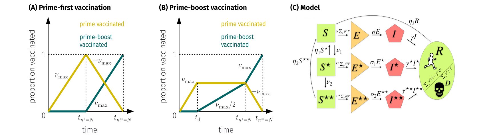

# vaccination

## Project Description

Many countries, especially low and middle income countries, are facing limited vaccination supply and fearing the increasingly wide-spread emergence of faster-spreading SARS-CoV-2 virus variants.

The majority of available vaccines require two immunization shots to provide maximum protection. Yet, the immunological response to the first (``prime``) injection may already  provide a substantial degree of protection against infection. Thus, it may be more effective to vaccinate as many people as possible with only one shot, instead of administering a person a second (``boost``) shot. Such a strategic vaccination campaign may help to more effectively slow down the spread of SARS-CoV-2, thereby reducing fatalities and the risk of collapsing health care systems.

Yet, the conditions which make single-dose vaccination favourable over prime-boost administrations are not well understood.

In this project, we combine epidemiological modeling, random sampling techniques, and decision tree learning to explore decisive conditions for strategic vaccination against SARS-CoV-2 as a function of the various time scales and epidemiological mechanisms at work.

Please run the files in ``excess_deaths`` to compute different mortality measures and analyze COVID-19 mortality data for different jurisdictions. (Make sure that you download the most recent source data, see below.) The coefficient of variation (CV) of the infection fatality ratio (IFR) can be directly calculated via ``IFR_CV.py``.



## Reference
* L. Böttcher, J. Nagler, [Decisive Conditions for Strategic Vaccination against SARS-CoV-2](https://www.medrxiv.org/content/10.1101/2021.01.10.21249524v1.full)

```
@article{bottcher2021decisive,
  title={Decisive Conditions for Strategic Vaccination against SARS-CoV-2},
  author={B{\"o}ttcher, Lucas and Nagler, Jan},
  journal={medrxiv preprint medrxiv:},
  year={2021}
}
```
